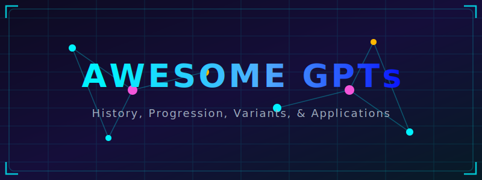
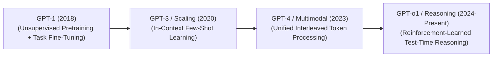

# Awesome-GPTs 🚀

  

  

## 📜 Generative Pre-trained Transformers (GPTs): History, Progression, Variants, & Applications

A **Generative Pre-trained Transformer (GPT)** is a foundational neural network architecture designed to process, model, and generate sequential data, most notably human natural language and programming source code. Developed on the architectural blueprint of the Transformer decoder, GPTs operate on the mathematical paradigm of **autoregressive next-token prediction**: given a historical sequence of tokens, the network computes a forward pass to output a probability distribution over a fixed vocabulary matrix to predict the absolute most likely next token [INDEX: 1, 22].

Over the history of artificial intelligence, GPTs and Large Language Models (LLMs) have transformed from lightweight textual feature extractors to multi-modal foundation models and reinforcement-learned autonomous reasoning systems, dictating the modern trajectory of scaling laws and generative computation.

---

## 📅 1. The Macro Chronological Evolution

The architectural development of GPT foundation systems has transitioned from task-specific discriminative fine-tuning to text-guided zero-shot prompts, multi-modal patch arrays, and native inference-time thinking loops.

| Era / Milestone | Core Concept & Details | First Used (Year) | Key Paper / Reference |
| :--- | :--- | :--- | :--- |
| [**The Unsupervised Pre-training + Supervised Tuning Era (GPT-1 & GPT-2)**](details/unsupervised_pretraining_supervised_tuning.md) | The architectural genesis pioneered by Alec Radford and the early OpenAI team. **GPT-1 (2018)** proved that pre-training a transformer decoder on a massive, unannotated dataset of raw text via self-supervised next-token prediction allowed the hidden layers to naturally internalize syntactic and semantic world logic. This was followed by **GPT-2 (2019)**, which dropped task-specific downstream fine-tuning entirely, proving that language models could act as zero-shot task solvers if the prompt text itself was framed as an instruction. | 2018 | [Improving Language Understanding by Generative Pre-training](https://s3-us-west-2.amazonaws.com/openai-assets/research-covers/language-unsupervised/language_understanding_paper.pdf) |
| [**The In-Context Learning & Scale Inflation Era (GPT-3)**](details/in_context_learning_scale_inflation.md) | Established the dominance of power-law scaling laws. GPT-3 exploded parameter capacity to 175 billion parameters, demonstrating the emergent phenomenon of **In-Context Learning (ICL)**. Instead of modifying structural weights, the model adapted its outputs on-the-fly simply by reading a few input-output examples provided directly within the temporary prompt window (few-shot prompting). | 2020 | [Language Models are Few-Shot Learners](https://arxiv.org/abs/2005.14165) |
| [**The Unified Multi-Modal Omni Era (GPT-4 / GPT-4o)**](details/unified_multimodal_omni_era.md) | Transformed GPTs from text-only models into omnidirectional multi-sensory processing engines. Rather than treating vision or audio as external auxiliary attachments, models like **GPT-4** and **GPT-4o** slice image frames into visual token patches natively [INDEX: 1]. They route pixels, acoustics, and text tokens through the exact same autoregressive transformer workspace concurrently, enabling native cross-modal reasoning without intermediate text transcription latelines [INDEX: 1]. | 2023 | [GPT-4 Technical Report](https://arxiv.org/abs/2303.08774) |
| [**The Native Inference-Time Search & Verification Era (GPT-o1 / o3)**](details/native_inference_time_search_verification.md) | The current modern state-of-the-art foundation standard. Overcomes the constraints of standard constant-time autoregressive generation (System 1 intuition) [INDEX: 1]. By internalizing large-scale **Reinforcement Learning (RL) search loops**, models like **o1** and **o3** scale test-time compute [INDEX: 1]. The model generates a verbose, hidden "thinking trace" before outputting characters, allowing it to execute self-correction, test mathematical identities, and backtrack from false assumptions natively [INDEX: 1]. | 2024 | [Learning to Reason with Transformers via Reinforcement-Learned Test-Time Compute Scaling Laws](https://openai.com/index/learning-to-reason-with-llms/) |

---

## 🧬 2. Core Functional & Architectural Variants

The generative pre-trained transformer paradigm is executed across distinct structural and tokenization topologies to manage routing, context scale, and computational complexity.

| Variant | Mechanism & Examples | First Used (Year) | Key Paper / Reference |
| :--- | :--- | :--- | :--- |
| [**Dense Transformers (Traditional Baseline)**](details/dense_transformers.md) | Every single token pass activates 100% of the parameter weights across the entire neural network graph. Maximize geometric modeling fidelity but introduces extreme operational compute costs at multi-hundred-billion parameter scales.   **Examples:** GPT-3, GPT-4-Dense | 2017 | [Attention Is All You Need](https://arxiv.org/abs/1706.03762) |
| [**Sparsely Routed Mixture-of-Experts (Sparse MoE)**](details/mixture_of_experts.md) | Decouples total parameter capacity from active token compute footprints. The traditional feed-forward network (FFN) layer is divided into multiple independent parallel sub-networks (Experts) [INDEX: 15]. A fast routing network reads incoming token embeddings and dynamically dispatches them to only 1 or 2 specialized experts per layer pass, maximizing capacity while keeping inference FLOP costs low [INDEX: 15].   **Examples:** GPT-4-MoE, Mixtral, DeepSeek-V3 [INDEX: 15] | 2021 | [Switch Transformers: Scaling to Trillion Parameter Models with Simple and Efficient Sparsity](https://arxiv.org/abs/2101.03961) |
| [**Unified Omni-Directional Modality Tokenizers (Native Multimodal)**](details/unified_directional_modality_tokenizers.md) | Maps multi-sensory inputs into a single shared coordinate sphere. Image pixels are tokenized into 2D structural patches [INDEX: 1], raw waveforms are serialized via discrete audio codebooks, and text is sharded via byte-level subword BPEs, aligning all sensory streams into a single contiguous autoregressive decoder matrix. | 2020 | [An Image is Worth 16x16 Words: Transformers for Image Recognition at Scale](https://arxiv.org/abs/2010.11929) |

---

## 🎯 3. Post-Training Curation & Alignment Types

Because raw pre-trained GPTs are purely statistical text-mimics that complete strings blindly, they must undergo extensive structural post-training layers to adopt safe, conversational, and instruction-following traits.

| Alignment Type | Profile & Description | First Used (Year) | Key Paper / Reference |
| :--- | :--- | :--- | :--- |
| [**Supervised Fine-Tuning (SFT) Alignment**](details/supervised_fine_tuning.md) | **Profile:** Character formatting. The pre-trained model is trained on a highly filtered pool of pristine prompt-response demonstrations, conditioning the network to adopt a distinct task syntax, helpful assistant persona, and clean markdown structure. | 2022 | [Training Language Models to Follow Instructions with Human Feedback](https://arxiv.org/abs/2203.02155) |
| [**Preference Optimization (RLHF / DPO)**](details/preference_optimization.md) | **Profile:** Behavioral shaping. Uses **Reinforcement Learning from Human Feedback (RLHF)** or **Direct Preference Optimization (DPO)** to optimize the policy over contrastive pairwise data grids, penalizing toxic, hallucinated, or unhelpful response tokens while reinforcing chosen alignment paths. | 2019 | [Fine-Tuning Language Models from Human Preferences](https://arxiv.org/abs/1909.08593) |
| [**Reinforcement Learning with Verifiable Rewards (RLVR)**](details/reinforcement_learning_verifiable_rewards.md) | **Profile:** Reasoning hard-locks [INDEX: 17]. Eliminates neural reward models by pairing the active policy straight with deterministic, programmatic verifiers (such as sandboxed code compilers or mathematical proof engines) [INDEX: 17]. The model only receives positive learning signals if its intermediate thinking traces pass absolute verification checks, forcing the parameters to internalize flawless symbolic logic rules [INDEX: 17]. | 2024 | [DeepSeekMath: Pushing the Limits of Mathematical Reasoning in Common Language Models](https://arxiv.org/abs/2402.03300) |

---

## ⚙️ 4. Production Engineering Challenges & Hardware Solutions

Deploying large-scale GPT systems across global enterprise serving nodes introduces intense memory allocation caps and memory-bandwidth constraints.

| Challenge / Solution | Problem & Mitigation | First Used (Year) | Key Paper / Reference |
| :--- | :--- | :--- | :--- |
| [**The Key-Value (KV) Cache VRAM Satiation Wall**](details/kv_cache_vram_satiation_wall.md) | **Problem:** During the auto-regressive decoding phase, the model must store the attention vectors (Keys and Values) for all preceding tokens in memory to avoid redundant matrix calculations [INDEX: 22]. As user prompt contexts expand to 128k+ thresholds, this KV cache explodes, consuming gigabytes of VRAM per session and triggering cluster-wide system crashes [INDEX: 22].  **Mitigation:** Implementing **Grouped-Query Attention (GQA)** or **Multi-Head Latent Attention (MLA)** to compress cache matrices into low-rank latent vectors, paired with **PagedAttention virtual memory indexing** to eliminate physical memory fragmentation [INDEX: 22]. | 2023 | [Efficient Memory Management for Large Language Model Serving with PagedAttention](https://arxiv.org/abs/2309.06180) |
| [**The High-Throughput Pre-fill vs. Decoding Asymmetry**](details/high_throughput_prefill_decoding_asymmetry.md) | **Problem:** GPT serving consists of two distinct physical phases: the *Pre-fill phase* (processing the user's initial prompt tokens all at once, which saturates GPU compute cores) and the *Decoding phase* (generating text sequentially token-by-token, which is heavily bottlenecked by GPU memory bandwidth). Running them synchronously over identical threads causes hardware stalls.  **Mitigation:** Implementing **Chunked Prefills and In-Flight Batching**, fracturing massive incoming prompts into small, manageable chunks that interleave smoothly with active generation tokens across execution batches [INDEX: 22]. | 2022 | [Orca: A Distributed Serving Serving System for Transformer-Based Generative Models](https://www.usenix.org/conference/osdi22/presentation/yu) |

---

## 🚀 5. Frontier Real-World AI Applications

| Application Domain | Description & Scaffolding | First Used (Year) | Key Paper / Reference |
| :--- | :--- | :--- | :--- |
| [**Autonomous Enterprise Code Generation & Repository Orchestration**](details/autonomous_enterprise_code_generation.md) | **Application:** Drives advanced coding platforms (such as Copilot or Cascade architectures) [INDEX: 22]. Inference-time search scaling and tool-augmented scaffolding allow the model to treat software tickets as an active debugging loop: reading file structures, generating patches, analyzing compiler tracebacks inside sandboxes, and refactoring scripts recursively until all code compiles cleanly [INDEX: 1, 17, 22]. | 2021 | [Evaluating Large Language Models Trained on Code](https://arxiv.org/abs/2107.03374) |
| [**Long-Horizon Corporate Regulatory & Legal Compliance Auditing**](details/corporate_regulatory_legal_compliance.md) | **Application:** Reviews multi-departmental financial portfolios and historical litigation records [INDEX: 1]. Unified GPT decoders parse text-dense PDFs, multi-axis charts, and structural blueprints concurrently, using interleaved retrieval-augmented reasoning to catch hidden corporate liability exposure or regulatory variances automatically [INDEX: 1]. | 2020 | [Retrieval-Augmented Generation for Knowledge-Intensive NLP Tasks](https://arxiv.org/abs/2005.11401) |
| [**High-Volume Multimodal Customer Experience & Action Frameworks**](details/multimodal_customer_experience_action.md) | **Application:** Powers intelligent consumer service networks. Native omni-directional models ingest streaming user vocal tracks and interface screenshots simultaneously, parsing natural intent and executing real-time backend API transactions (e.g., executing inventory restocking or routing data entries) without manual oversight. | 2021 | [WebGPT: Browser-assisted question-answering with human feedback](https://arxiv.org/abs/2112.09332) |

---

## 📚 References
1. Vaswani, A., et al. (2017). Attention is all you need. *Advances in Neural Information Processing Systems (NeurIPS)*, 30.
2. Radford, A., et al. (2018). Improving language understanding by generative pre-training. *OpenAI Technical Whitepaper*.
3. Radford, A., et al. (2019). Language models are unsupervised multitask learners. *OpenAI Blog Monograph*.
4. Brown, T., et al. (2020). Language models are few-shot learners. *Advances in Neural Information Processing Systems (NeurIPS)*, 33, 1877-1901.
5. Fedus, W., Zoph, B., & Shazeer, N. (2021). Switch transformers: Scaling to trillion parameter models with simple and efficient sparsity. *arXiv preprint arXiv:2101.03961*.
6. Achiam, J., et al. (2023). GPT-4 technical report. *arXiv preprint arXiv:2303.08774*.
7. OpenAI. (2024). Learning to reason with transformers via reinforcement-learned test-time compute scaling laws. *OpenAI o1 System Launch Technical Document* [INDEX: 1].

---

To advance this documentation repository, structural setup, or post-training pipeline, consider exploring these adjacent development pathways:
* Build a **Python script using PyTorch and the Hugging Face API** illustrating how to load an open-weight GPT-style model, configure an explicit `BitsAndBytes Config` for low-precision 4-bit loading, and execute text generation via nucleus sampling.
* Generate a **comprehensive Markdown table** explicitly comparing GPT-1, GPT-3, GPT-4 (MoE), and GPT-o1 across total parameter capacities, active parameters per token, context window boundaries, training loss objectives, and native test-time compute architectures [INDEX: 1, 15].

Establish a performance evaluation harness using Triton to profile exactly how compiling a Grouped-Query Attention (GQA) rolling cache mechanism straight into GPU registers alters the wall-clock token generation throughput of high-concurrency cloud serving nodes [INDEX: 22].

##  Star History

<a href="https://www.star-history.com/?repos=ishandutta2007%2FAwesome-GPTs&type=date&legend=bottom-right">
<picture>
<source media="(prefers-color-scheme: dark)" srcset="https://api.star-history.com/chart?repos=ishandutta2007/Awesome-GPTs&type=date&theme=dark&legend=bottom-right" />
<source media="(prefers-color-scheme: light)" srcset="https://api.star-history.com/chart?repos=ishandutta2007/Awesome-GPTs&type=date&legend=bottom-right" />

</picture>
</a>

