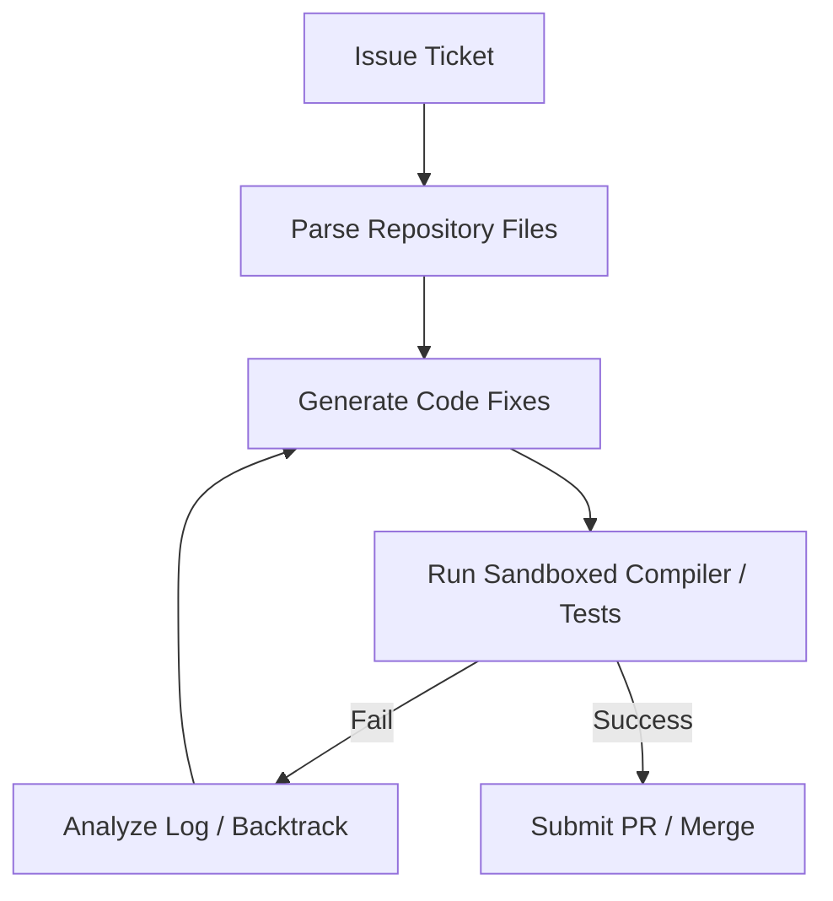

# Autonomous Enterprise Code Generation & Repository Orchestration

LLM agent orchestration for parsing, implementing, and debugging full software repositories.

### Overview
- **Agent Scaffolding:** Surrounds LLMs with tools to read, write, and execute code within sandboxed environments.
- **Iterative Debugging:** Allows systems to dynamically correct errors based on real-time feedback loop tracebacks.

[← Back to README](../README.md)
