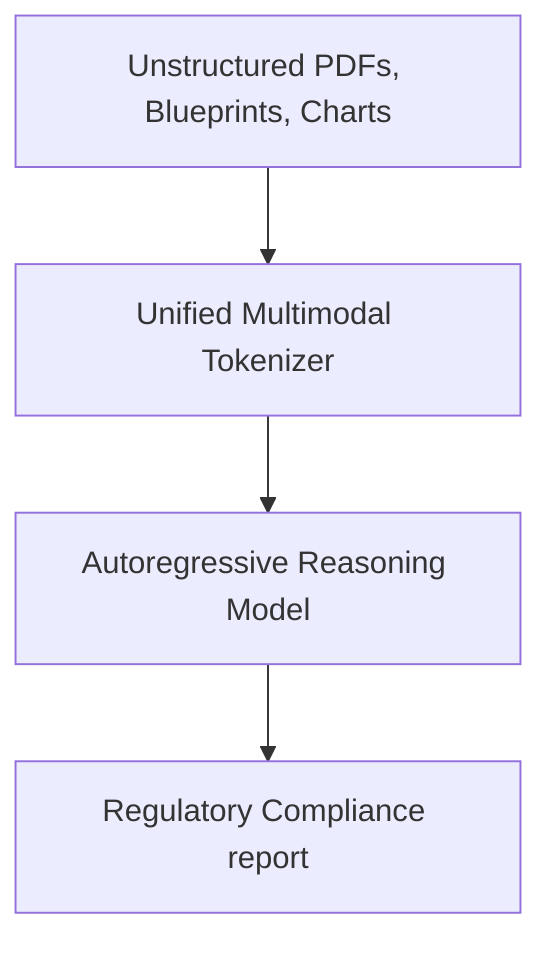

# Long-Horizon Corporate Regulatory & Legal Compliance Auditing

Utilizing long-context unified models to parse, extract, and audit legal frameworks.

### Overview
- **Interleaved RAG:** Ingests document arrays alongside structured tables to answer multi-hop retrieval questions.
- **Multimodal Auditing:** Checks legal portfolios, structural charts, and tax sheets in parallel, flagging discrepancies dynamically.

[← Back to README](../README.md)
