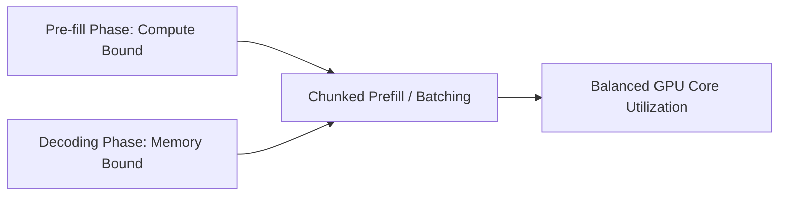

# The High-Throughput Pre-fill vs. Decoding Asymmetry

Optimizing inference engines by partitioning the different computational phases of generation.

### Overview
- **Pre-fill Phase:** Ingests the initial prompt all at once, maximizing GPU core occupancy (compute-bound).
- **Decoding Phase:** Generates text token-by-token, heavily waiting for GPU VRAM transfers (memory-bandwidth bound).
- **Interleaved Batching:** Fractures pre-fills into smaller batches, slotting them alongside decode operations to optimize device utilization.

[← Back to README](../README.md)
