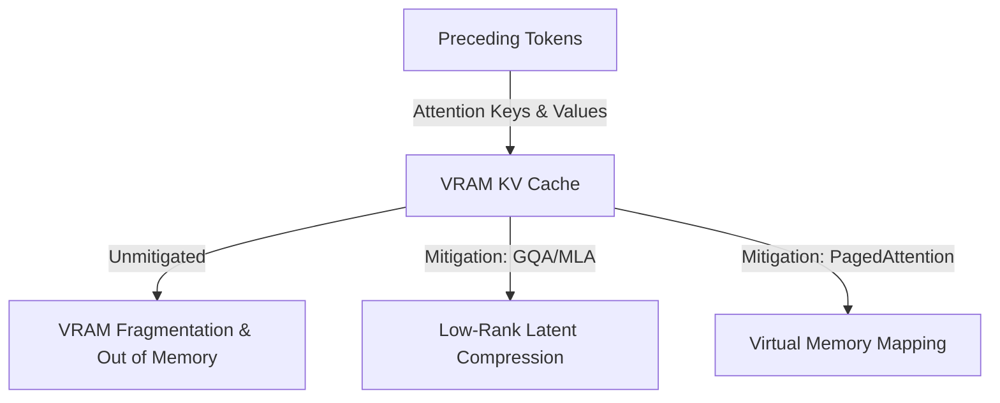

# The Key-Value (KV) Cache VRAM Satiation Wall

Managing the scaling challenges of attention keys and values for long-context sequences.

### Overview
- **Storage Bottlenecks:** Autoregressive models cache previous Keys and Values to avoid redundant attention recalculation. Long prompts explode this storage requirement.
- **Mitigation Architectures:** Uses Grouped-Query Attention (GQA) and Multi-Head Latent Attention (MLA) to compress the cache size, and PagedAttention to reduce physical memory fragmentation.

[← Back to README](../README.md)
