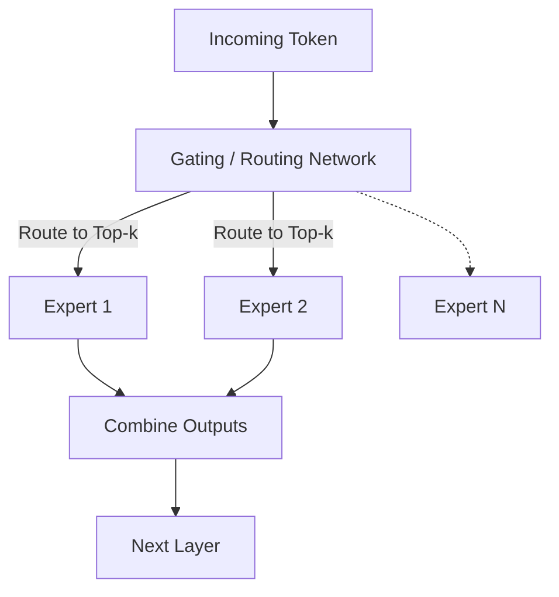

# Sparsely Routed Mixture-of-Experts (Sparse MoE)

Mixture-of-Experts decouples model capacity from actual inference-time compute.

### Overview
- **Routing Network:** Dynamically directs token embeddings to selected expert feed-forward sub-networks.
- **Sparse Activation:** Active parameter count remains small relative to the total capacity, optimizing scaling efficiency.

[← Back to README](../README.md)
