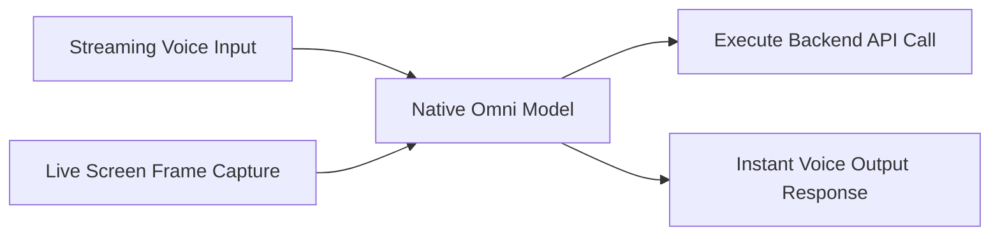

# High-Volume Multimodal Customer Experience & Action Frameworks

Empowering consumer service agents with real-time audio, vision, and system-level actions.

### Overview
- **Omni Streaming:** Simultaneously digests real-time audio and screen pixels.
- **Action Execution:** Automatically parses user request intent and maps it to specific backend system API calls.

[← Back to README](../README.md)
