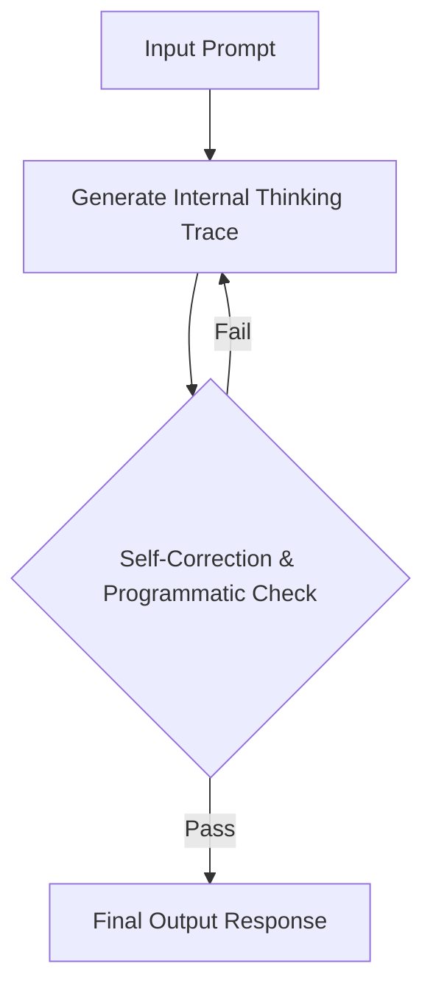

# Native Inference-Time Search & Verification Era (GPT-o1 / o3)

Overcoming the limitations of constant-time generation, newer models scale test-time compute.

### Overview
- **System 2 Reasoning:** Integrates reinforcement-learned test-time search loops. The model evaluates its intermediate responses, checks mathematical identities, and performs error correction.
- **Thinking Traces:** Generates hidden chain-of-thought steps, which scale reasoning performance dynamically based on computation time.

[← Back to README](../README.md)
