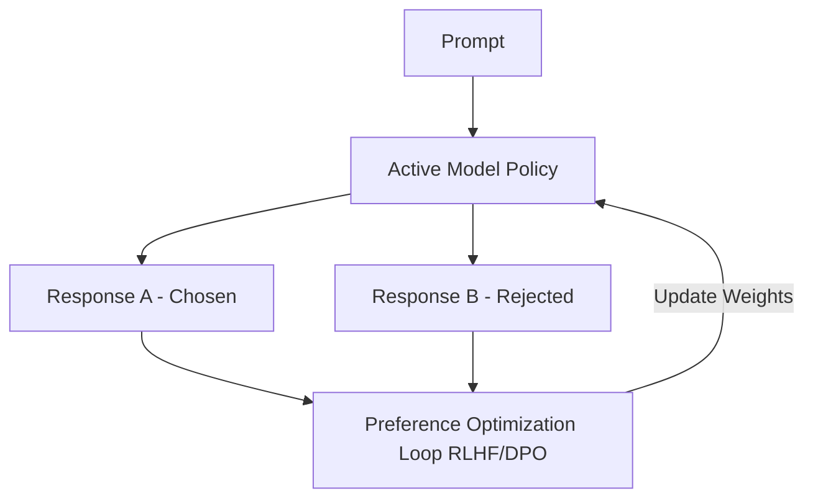

# Preference Optimization (RLHF / DPO)

Aligning LLM outputs with human guidelines through preference curation.

### Overview
- **RLHF (Reinforcement Learning from Human Feedback):** Uses a neural reward model to steer language generation outputs using reward maximization algorithms (e.g., PPO).
- **DPO (Direct Preference Optimization):** Optimizes the policy directly on pairwise preferences, bypassing explicit reward modeling.

[← Back to README](../README.md)
