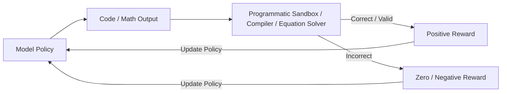

# Reinforcement Learning with Verifiable Rewards (RLVR)

Replacing subjective reward models with programmatically verifiable loops.

### Overview
- **Programmatic Verifiers:** Evaluates outputs against structured, sandbox compilers, math checkers, or tests rather than neural models.
- **Rule Hard-Locks:** Restricts feedback loops to logical, deterministic results, reinforcing correct reasoning steps.

[← Back to README](../README.md)
