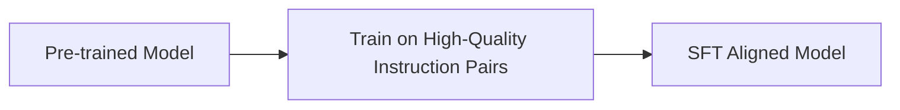

# Supervised Fine-Tuning (SFT) Alignment

Supervised fine-tuning guides raw base models to match target response formats.

### Overview
- **Instruction Data:** Involves training the model on clean, manually-curated prompt-response pairs.
- **Formatting Guidance:** Conditions parameters to behave like an assistant, adopting structure, helpfulness guidelines, and formatting standards.

[← Back to README](../README.md)
