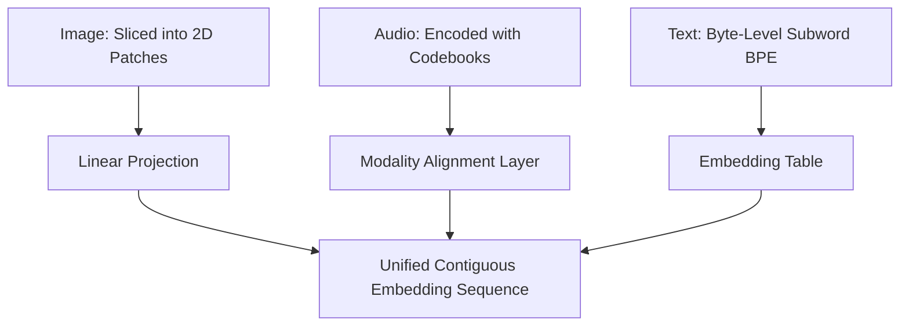

# Unified Omni-Directional Modality Tokenizers (Native Multimodal)

Tokenization strategies are unified to represent various data modalities in a shared vocabulary format.

### Overview
- **Visual Patches:** Converts 2D images into flat sequence chunks, treated similarly to text words.
- **Audio Codebooks:** Maps acoustic waveforms into discrete token tokens.
- **Byte-Pair Encoding (BPE):** Segments language texts into robust tokenized subwords.

[← Back to README](../README.md)
