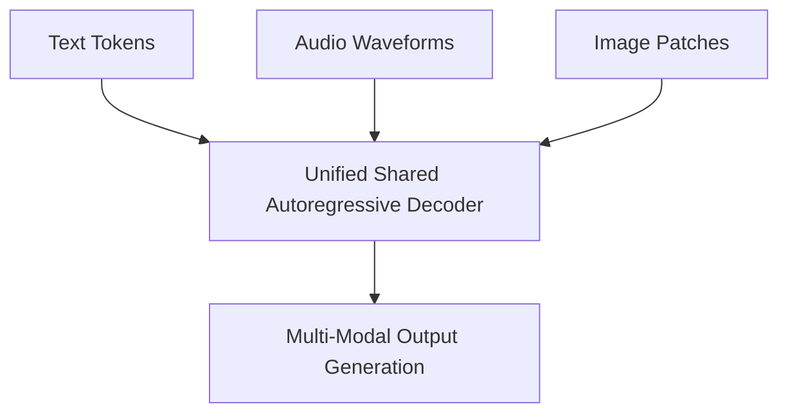

# Unified Multi-Modal Omni Era (GPT-4 / GPT-4o)

Transitioning from text-only processing, modern transformer architectures leverage unified multi-sensory tokenization.

### Overview
- **Native Multimodality:** Models process acoustic waveforms, visual pixels, and subword texts concurrently without relying on external transcription engines.
- **Interleaved Sequences:** Aligns multiple sensory streams into a single contiguous autoregressive context window.

[← Back to README](../README.md)
