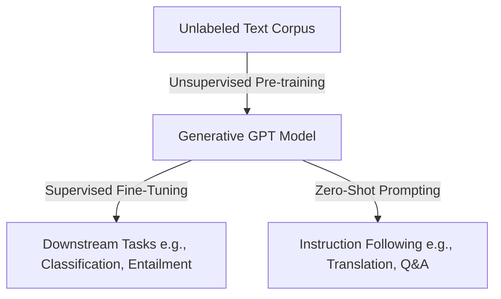

# Unsupervised Pre-training + Supervised Tuning Era (GPT-1 & GPT-2)

The architectural evolution of generative pre-trained transformers began with the shift from task-specific architectures to a unified pre-training framework. 

### Overview
- **GPT-1 (2018):** Introduced unsupervised pre-training followed by task-specific supervised fine-tuning. This demonstrated that pre-training on a diverse corpus of unlabeled text allows the model to learn linguistic structure and world knowledge.
- **GPT-2 (2019):** Extended this by demonstrating zero-shot task transfer. By showing that language models can perform downstream tasks without parameter modification, GPT-2 set the stage for general-purpose language assistants.

[← Back to README](../README.md)
